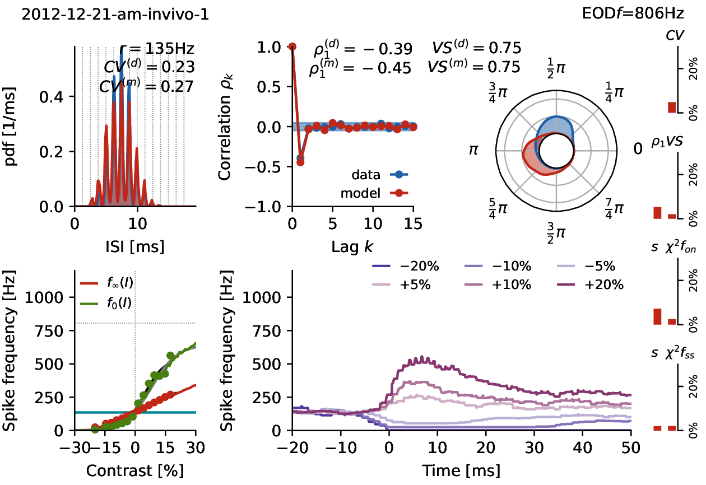

# P-unit model

Cell specific integrate-and-fire type models for a population of
P-unit electroreceptors of *Apteronotus leptorhynchus*.


## Model parameters

Model parameters are stored in csv files.

- `models.csv`: the original model parameters.
- `models_202106.csv`: model parameters from a newer fitting attempt.

- `goodcells.dat` contains in each line a cell identifier of those
  cells where the models fit the cells reasonably well.




## model.py

The model.py module provides two functions:

- `load_models()`: load the model parameters from a csv file into a
   list of dictionaries.

- `simulate()`: simulate a model for a given stimulus.

Requires `numpy`. `numba` is optional, but you should definitely use
it to considerably speed up simulation times.


## Example

`main.py` is an example script that demonstrates how to load the model
parameters, prepare a stimulus, and simulate the models.

The EOD of a single fish always has an amplitude of one. The EOD
frequency is in the table with the model parameters.


## Profiles

The python script `punitprofiles.py` generates for each model cell a
pdf with plots showing basic properties of the model in comparison o
the real cell's data. The plots are placed into the `plots/` folder.

The image of the example cell shown above was generated wih this script.

Requires:

- [`thunderlab`](https://github.com/bendalab/thunderlab):
  Install from [PyPI](https://pypi.org/project/thunderlab) it using pip
  ```sh
  pip3 install thunderlab
  ```
- [`plottools`](https://github.com/bendalab/plottools): Install it from github using pip
  ```sh
  pip3 install git+https://github.com/bendalab/plottools.git
  ```
- `numpy`, `scipy`, `pandas`, `matplotlib`